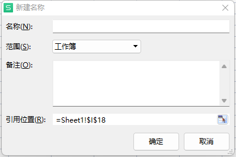

# 使用wps批量提取本地文件名生成excel表格

> 打开wps（excel）

---

> 名称管理器的使用

1. 位置：公式》名称管理器》新建

名称随便命名即可。

引用位置为

`=FILES("C:\Users\ASUS3\Desktop\多媒体第一次作业（10.13）\*.*")`

其中第一个\*号表示文件名，第二个\*号表示后缀名，使用\*时，读取所有后缀名的文件。

如：

`=FILES("C:\Users\ASUS3\Desktop\多媒体第一次作业（10.13）\*.jpg")`

则表示只读取*C:\Users\ASUS3\Desktop\多媒体第一次作业（10.13）*路径下的.jpg文件。

2. 生成excel，在文件中选择一个单元格输入公式

在表格里生成了单个文件名，注：**"测试"为上面公式所对应的名称，"B2"表示对应单元格。**。然后通过下拉即可批量生成文件名。

后续可以通过单元格分列处理后缀名，或把数据分成想要的格式。

