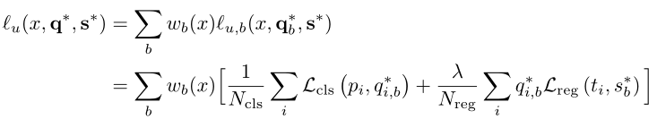
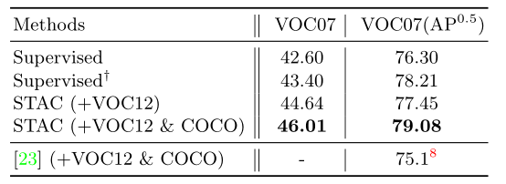

# （STAC）一种简单的目标检测半监督学习框架

## 摘要

半监督学习在提高无标记数据的机器学习模型的预测性能方面具有很大的潜力。虽然已经取得了显著的进展，但SSL中的演示范围仅限于图像分类任务。

本文中，我们提出了STAC，**一个简单而有效的用于目标检测的SSL框架，以及一个数据增强策略。**对未标记的对象部署高度可信的伪标签，通过强增强增强一致性来更新模型。

## 引入

ssl受到越来越多的关注，因为它提供了在大规模注释数据不可用的情况下使用无标记数据来改进模型性能的方法。

一种流行的ssl方法是基于一致性的自训练。核心思想：为无标记数据生成人工标签，然后训练模型预测（未标记数据提供语义保留随机增强的）人工标签。人工标签即可以是one-hot预测（hot），也可以是模型的预测分布（soft）。

ssl成功的另一个支柱来自于数据扩充方面的进步。数据增强提高了深度神经网络的鲁棒性，并被证明对基于一致性的自我训练特别有效。**增强策略跨越了基本图像变换的手工结合到神经图像合成和通过强化学习学习的策略**，如：旋转、平移、翻转或颜色抖动。

最近，复杂的数据增强策略，如：RandAugment或CTAugment，已被证明对SSL的图像分类非常强大。ssl方法在取得显著进展的同时，主要应用于图像分类，图像分类标记成本相对cv中的其他任务如目标检测，相对较低。

由于目标检测昂贵的标签成本，对标签效率的要求也较高，因此需要开发更强的ssl方法。另一方面，现有的大多数目标检测工作都集中在给予足够的标注数据来训练一个更强和更快的检测器。现有的用于目标检测的ssl研究很少依赖于附加的上下文，如：对象的类别相似性或视频的时间一致性。

本文利用从图像分类上的深度ssl中学到的经验教训来解决ssl的目标检测问题。为此，本文提出了一个用于目标检测的ssl框架，该框架结合了**自训练（通过伪标签）**和基于强数据增强的**一致性正则化**。受Noisy-Student的启发，我们的系统包含两个阶段的训练。

第一阶段，使用所有标记的数据训练一个目标检测器（如：Faster RCNN）直到收敛。

然后使用训练过的检测器预测未标记的局部对象的边界框和类标签。

然后根据FixMatch的设计灵感，对每个高阈值的预测框（经过非极大抑制后）进行基于置信度的盒过滤去获得高精度的伪标签。

第二阶段，对每一张无标签图像进行强数据增强，用有标签数据和无标签数据第一阶段生成的伪标签对模型进行训练。

受RandAugment及其对SSL和目标检测的成功适应的鼓舞。我们**设计了用于目标检测的增强策略，该策略包含全局颜色变换、全局或盒级几何变换、Cutout**。

在公共数据集ms-coco和pascal voc上测试了stac的有效性。利用ms-coco数据集设计了新的实验协议来评估目标检测的半监督性能。使用1%、2%、5%和10%的标记数据作为标记集，其余数据作为为标记集，以评估低标记状态下ssl的有效性。

此外，使用所有标记数据作为标记集，ms-coco提供的附加未标记数据作为未标记集进行评估。在之后，将voc07的train和val作为标记集，将有或没有ms-coco的无标记数据的voc12的trainval作为无标记集。虽然很简单，但STAC在map中带来了显著的增益:在5%协议上18.47到24.38，在10%协议上23.86到28.64，如下图所示，在PASCAL VOC上42.60到46.01。

主要贡献：

1. 开发了STAC，一个用于目标检测的SSL框架，它无缝扩展了基于自训练和增强驱动一致性正则化的最先进的ssl分类方法。
2. STAC很简单，只引入了两个新的超参数：置信阈值τ和无监督损失权重λu，它们不需要大量额外的调优工作。
3. 提出了使用mscoco进行ssl目标检测的新实验协议，并在Faster rcnn框架中演示了STAC对ms-coco和pascal voc的有效性。

## 相关工作

介绍了最近的目标检测工作，和半监督的方法，提出观点，认为更强的半监督检测器需要进一步研究非监督目标和数据增强。

**ssl**近年来得到了极大的改进。

一致性正则化成为近年来流行的方法之一。其想法是加强模型，以在标签保存的数据扩充中生成一致的预测。eg：Mean-Teacher[54]、UDA[58]和MixMatch[4]。

ssl的另一个流行类别是伪标签，被视为一致性正则化的hard版本：该模型进行自训练，生成未标记数据的伪标签，然后训练随机增强的未标记数据匹配各自的伪标签。即：对同一未标注的例子的预测是一致的。如何使用伪标签是ssl成功的关键。

eg：Noisy-Student 演示了一个迭代的师生框架，它重复使用教师模型标记作业的过程，然后训练一个更大的学生模型。这种方法利用未经标记的额外图像，实现了最先进的ImageNet分类性能。FixMatch演示了一个简单的算法，它优于以前的方法，并建立了最先进的性能，特别是在不同的小标签数据体系上。FixMatch背后关键思想，当弱增强数据的模型置信度较高时，将强增强的未标记数据的预测匹配到弱增强对应数据的伪标签。

鉴于这些方法的成功，本文利用伪标记和伪框以及数据增强的有效利用来改进目标检测。

**数据增强**对于提高模型的泛化和鲁棒性至关重要。特别是逐渐成为半监督学习的主要推动力，发现适当的颜色转换和输入空间的几何变换已被证明是提高泛化的关键。然而，大多数增强算法主要研究在图像分类中。用于目标检测的数据增强的复杂性远远高于图像分类，因为数据的全局几何变换会影响边界框注释。一些研究提出了用于监督对象检测的增强技术，如MixUp、CutMix或增强策略学习。最近提出的基于一致性的ssl对象检测方法利用全局水平翻转（弱增强）构造一致性损失。就我们所知，密集数据增强对半监督目标检测的影响还没有被很好的研究

## 方法

### 背景：ssl中的无监督损失

制定利用未标记数据的无监督损失是ssl的关键。

ssl在分类方面的许多进步依赖于某些形式的一致性正则化。我们为图像分类提供了一致性正则化的统一观点。对于K-way分类，一致性正则化如下：

where x ∈ X is an image，w（x），将x映射为二进位值。 L(·, ·)测量两个向量之间的距离。典型的L2距离和交叉熵。这里，p表示由θ参数化的模型的预测，q是预测目标，w是决定x对损失贡献的权重。

例如，伪标签具有如下配置：

最先进的ssl算法，如：UDA或FixMatch，应用强数据增强A，如RandAugment[58]或CTAugment[3]，对模型预测p(A(x);θ)提高鲁棒性。noise - student[59]将不同形式的随机噪声应用到模型预测中，包括通过RandAugment的输入增强，以及通过dropout[50]和随机深度[22]的网络增强。虽然它们在模型预测上有相似之处，但在生成预测目标的q上有所不同。

与前面许多算法不同的是，noise - student算法除了使用软目标或硬目标外，还使用了p(·，θ)以外的“教师”网络来生成伪标签q(x)。教师模型独立于训练时的模型，这在选择网络架构或优化方面提供了可伸缩性和灵活性。

### STAC

基于Self-Training（通过伪标签）和增强驱动一致性正则化，开发了一个新的对象检测SSL框架，称为STAC。首先，采用Noisy-Student的阶段性训练，提高其可扩展性和灵活性。这涉及到至少两个阶段的训练，在第一阶段，我们使用所有可用的标记数据训练教师模型，在第二阶段，我们使用标记和非标记数据训练STAC。其次，受FixMatch[49]启发，我们使用一个高值的阈值进行基于置信度的阈值划分，以控制对象检测中由边界框及其类标签组成的伪标签的质量。

训练步骤总结：

1. 用可用的标记图像训练教师模型。
2. 使用训练过的教师模型生成未标记图像（即边界框及其类标签）的伪标签。
3. 对未标记的图像应用强数据增强，并在应用全局几何变换时相应地增强伪标签（即边界框）。
4. 计算非监督损失和监督损失来训练检测器。

#### 训练教师模型

基于Faster RCNN，共享骨干网的顶部有一个CLS和RPN头。每个头有两个模块，即区域分类器（例如，用于cls头的（K + 1）路分类器或用于RPN头的二进制分类器）和边界框回归器。为了简单起见，给出了RPN头的Faster RCNN的有监督和无监督损耗。

监督损失记录如下：

### 生成伪标签

我们从教师模型执行目标检测器的测试时间推断，以生成伪标签。也就是说，伪标签的生成不仅涉及到主干的向前传递，RPN和CLS网络，还有后处理，如：NMS。这与传统的分类方法不同，在传统的分类方法中，置信度分数是从原始预测概率计算出来的。

我们使用NMS之后返回的每个边界框的分数，它聚合了锚框的预测概率。在NMS之后使用框预测比使用原始预测（在NMS之前）有优势，因为它消除了重复预测。并不能过滤掉错误位置的box。

### 无监督的损失

当给定一个未标记的图像x和一组预测的边界框及其置信度评分时，对于所有的锚点box，

我们确定q∗i,b,一个锚点i相对于伪box b的二进制标签，对于所有锚点，box pairs。设s∗b未伪box的坐标。STAC的无监督损失写为：

其中，如果预测框b的置信度评分高于阈值他T，则wb(x)=1，否则为0。将Faster RCNN的损失公式分解为单个box的损失之和。使得从分类（1）到检测（4）的转换更透明。需要注意的是，非监督损失是每个box掩码而不是每个图像。总之，RPN通过联合最小化以下两种损失来训练：

A是应用与未标记图像的强数据增强。由于某些变换操作对box坐标并不是不变的。（eg：全局几何变换），因此增广算子A也应用于伪box坐标S*上。

STAC的loss引入了两个超参数τ和λu。在实验中，我们发现τ = 0.9和λu∈[1,2]是有效的。

【23】中基于一致性的SSL对象检测方法需要复杂的λu三阶段加权调度，其中包括时间上升和下降。相反，我们的系统通过一个简单的恒定加权调度展示了有效的性能，因为我们的框架使用强大的数据增强策略强制增强了一致性。

### 基于一致性的SSL方法

基于一致性的ssl方法成功的关键因素是强大的数据增强。虽然有监督和半监督图像分类的增强策略已经被广泛研究，但在目标检测方面还没有太多的努力。我们通过使用最近提出的增强搜索空间扩展了[6]中使用的对象检测RandAugment通过[箱级转换]以及Cutout。下面描述转换操作的列表。每个操作都有一个大小，决定了强度的增强程度。

1. 全局颜色转换（C）：使用[7]中的颜色转换操作和每个操作的建议幅度范围。
2. 全局几何变化（G）:使用[7]中的几何变换操作，即x-y平移、旋转和x-y剪切。
3. Box-level transformation （B）：使用来自全局几何变换的三种操作，但具有较小的幅度范围。

对于每个图像，按如下顺序应用变换操作：

首先，我们应用从c中采样的一个操作。其次，我们应用从G或B中采样的一个操作。最后，我们在整个图像的多个随机位置上应用Cutout，以防止在边界框内单独应用时出现琐碎的解。

注：

1 .度的范围是经经验选择的，没有调整。

2 .以百分比表示的平移范围是图像宽度或高度的[- 10%，10%]。旋转和剪切范围在程度上为[- 30%，30%]。

3 .以百分比表示的翻译范围是图像宽度或高度的[- 5%，5%]。旋转和剪切范围在程度上为[- 10%，10%]。

4 Cutout区域的数量从[1,5]中采样，区域大小从应用图像短边的[0%，20%]中采样。

### 实验

1%大概1.2k图像，2%包含额外的1.2K张，并且其余的数据集以类似的方式构造。第一种协议评估，标记示例必须可用。第二种协议评估，在已有大规模标记数据的技术上利用未标记数据改进最先进的目标检测器的潜力。

之后，在pascal voc上进行了测试。训练集设置为voc07，5011张来自20个对象类别的图像作为标记训练数据，使用voc12训练集中的11540张图像作为无标记训练数据。

在voc07测试集上评估了检测性能，除ms-coco度量外，还报告了IoU为0.5时的mAP。

### 实现细节

实现是基于Tensorpack的Faster RCNN和FPN库。目标检测器模型使用Resnet骨干。除非另有说明，在训练的所有阶段，网络权值都由imagenet预训练的模型初始化。由于目标检测器的训练相当复杂，对于所有的实验，除了学习策略，我们保持默认的学习设置。

大多数实验都是使用**quick learning schedule**，只有100%MS-COCO协议例外。当使用更多标记的训练数据和更复杂的数据增强策略时，更长的训练时间会显著提高模型的性能。

引入两个新的超参，T作为置信阈值，λu作为无监督损失。除ms-coco的100%协议外，使用T=0.9和λu = 2进行所有实验，其中我们降低阈值T=0.5以增加伪标签的召回率。

### 结果

STAC与使用不同数据增强策略的各种实验协议的监督模型进行比较。

第五章

...