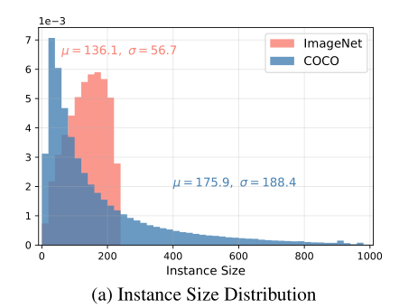
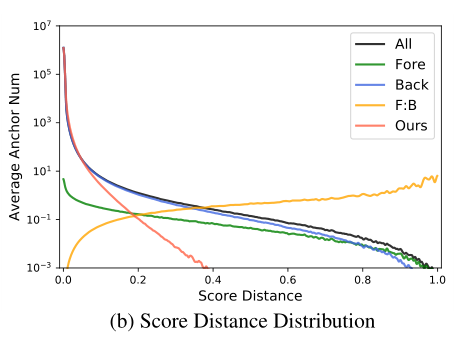
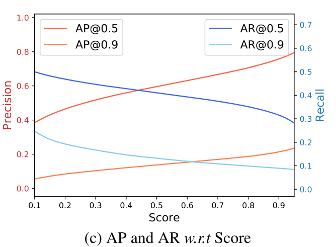
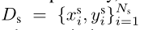
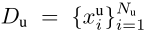
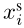
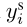
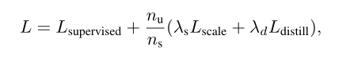
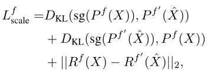

# 用于半监督目标检测的尺度等效蒸馏

## 摘要

目前的半监督目标检测方法主要基于自训练，即通过教师模型在未标记的数据上生成硬伪标签作为监督信号。

结合实证分析现有方法面临的挑战，发现大量的假阴性样本和较低的定位精度缺乏考虑。此外，物体大小的巨大差异和类别的不平衡（即背景和物体的极端比例）阻碍了现有技术的表现。

此外，通过引入一种新的方法：规模等效蒸馏（SED）来克服这些挑战，简单有效的端到端知识蒸馏框架。对大型对象大小差异和类不平衡具有健壮性。

优点：

1. 采用一致性正则化方法处理大规模方差问题。
2. SED算法缓解了假阴性样本的噪声问题和定位精度不高问题。
3. 重加权策略可以隐式筛选未标记数据的潜在前景区域，减少类不平衡的影响。

## 引入

最近的ssod方法通过利用有限的标记数据和大量的未标记数据来提高性能，但它们存在对象大小差异大、大量假阴性样本和类不平衡的问题。对于ImageNet分类模型来说，对象的尺度变化范围很小，而对于检测器来说，MS-COCO数据集的尺度变化在对象实例之间是很大的。

MS-COCO的实例规模为188.4像素，而ImageNet的实例规模为56.7像素(面积的平方根)。

检测器的尺度应该与对象实例一致，即对不同大小的图像的预测应该是等价的。ssod现有技术没有考虑尺度一致性。

客观性评分的差异，随着评分距离变大，前景锚点与背景锚点的比例增加，这意味着模型检测到一个对象实例，而对不同大小的实例视而不见。这种不一致通常通过多尺度推理集成来缓解，这增加了计算成本，需要复杂的操作来融合结果。 **？？？？**

此外，由于假阴性目标实例和较低的定位精度，目前的ssod方法在高数据场景下性能适中。

Iou设置为0.5和0.9时，召回率分别下降到0.1和0.3，说明大多数前台实例为假阴性样本。Iou = 0.9 处的精度小于0.2，说明边界框的定位不够精确。低于硬性阈值的假阴性对象实例会导致识别不一致。

另一个障碍是前景和背景样本高度不平衡。eg：RetinaNet，前景与背景样本的比例约为1：25000。由于类不平衡问题，平等对待所有区域会导致背景样本对梯度的贡献显著。从具有压倒性背景区域的未标记数据中识别前景区域是具有挑战性的。

本文：为了克服上述挑战，提出 规模等效蒸馏（SED），设计了一个跨越不同层次预测的尺度一致性正则化，以解决较大的对象大小方差。

此外，针对硬伪噪声对识别一致性的不利影响，提出了一种不增加可学习参数的自蒸馏方法来提高泛化性能。

由于类不平衡的问题，过多的背景样本削弱了我们方法的效果。我们实现了一种重加权策略，以关注不同级别输出之间的不一致以及教师模型和学生模型的不一致。因此，我们的重加权方法避免了从未标记的数据中显式地选择潜在的前景区域。

贡献：

1. sed采用尺度一致性正则化来克服大尺度方差的挑战。
2. 消除了假阴性样本和边界框回归不准带来的噪声问题。
3. 重加权策略，从未标记的数据中隐式筛选出潜在的前景区域，减少类不平衡的影响。

## 相关工作

**自训练。**对于分类，表现良好。然后，在平衡数据集上，半监督目标检测比半监督图像分类更具挑战性。

一些研究有助于缓解伪标签带来的噪声问题。eg：在两阶段检测器上增加了额外的模块，克服前景和背景分类中过拟合严重的问题，并通过集成方法对硬伪标签进行改进。然而，基于硬伪标签的方法存在一个固有的缺陷，即使假阴性对象实例影响识别的一致性。尤其是在靠近硬阈值的情况下。

有的文章采用软伪标签，避免了识别的不一致性，但对所有区域一视同仁。由于前景和背景的极度不平衡，两种区域的梯度贡献有很大不同。UBT采用Focal loss缓解这一问题。与现有方法不同的是，该方法在线生成未标记数据的软伪标签，重加权策略自动筛选未标记数据的潜在前景区域。

**一致性正则化**基于一致性的半监督学习利用无标记数据来稳定输入或权重扰动下的预测。例如，同一图像的两个不同视图应该有相似的输出。这类方法不生成伪标签，但约束输出之间的差异，这有助于平滑流形。对于SS-OD, CSD应用简单的水平翻转一致性正则化来训练检测器对翻转扰动的鲁棒性。

一致性损失微调了预测框的位置，但忽略了对象尺度的扰动，这在数据集中更常见。

我们的方法，将不同尺度的预测正则化，以解决大尺度的变化。此外，自蒸馏得益于EMA教师的高质量预测，从软目标的角度可以视为一致性正则化。

**预训练**近年来已经成为一种范式。大规模数据集加快收敛，有助于提高小数据泛化能力。在本文中，将ImageNet预先训练的骨干作为默认值进行微调，以便在进入低数据状态时更快收敛和更好的结果。

## 规模等价蒸馏

**问题定义**：半监督学习介于监督学习和非监督学习之间。

具体而已：我们的模型是用一个标记集和一个未标记集表示的

x表示图片，Ns、Nu表示标记集和未标记集图片的数量，对于每个监督图像，标注由图像中边界框的位置和类别组成。

**综述**：训练过程中，尺度等效蒸馏包括两个分支，有监督分支和无监督分支。有监督的分支按照正常程序进行训练。无监督的分支是在教师学生框架下，在这个框架中，教师被实施为学生的移动平均值的指数。

SED的目标是对输入的规模变量进行一致的预测。实践中，学生处理了强增强的无标签图像和调整大小的图像。将弱增强图像输入教师网络，预测软伪标签。尺度一致性损失限制了不同尺度图像的输出。同时，设置软伪标签作为强增强图像的目标。最终损失是监督损失和非监督损失的加权和：

Nu和Ns表示未标记数据和标记数据的批大小，scale是一致性损失，distill是自蒸馏损失。对于两阶段，无监督损失应用于RPN和ROI头部。

**规模一致性正则化**：

提出了尺度一致性正则化算法，使检测器在尺度维度上预测平稳一致。

通常，在特征金字塔网络下的主流检测器优于单一特征映射对应，因为多尺度特征表示在语义上很强。

尺度一致性正则化可以扩展到两阶段检测器和单特征映射检测器。

rpn和单阶段检测，所有锚点都是正则化的，以保持一致性，根据简单的IoU阈值匹配策略，甚至有些IoU可能无法被分配标签。

第二阶段检测器中，提议首先通过NMS和Top-K选择过滤，这也是监督分支的默认操作。然后将调整后的图像上预测的提议坐标放大2倍，以匹配原图。

来自图像对的提议被简单地连接成一个新的提议，用于细化边界框和预测分类分数。对于fast-rcnn的第二阶段，建议对的所有预测都通过尺度一致性损失以类似的方式正则化。

实现两阶段检测器时，Rol-Pooling操作符可以从同一级别的提议组合提取特征图，与单阶段检测器略有不同，尽管如此，这种操作具有相同的核心思想，即检测器应该是尺度一致的。

#### 自蒸馏

## 结论

