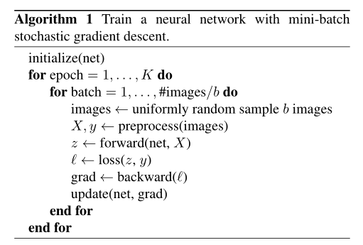
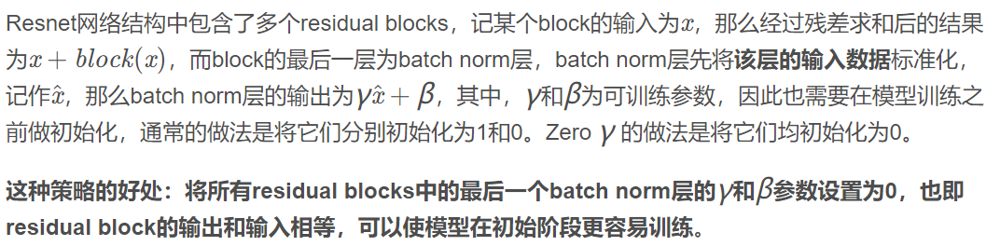
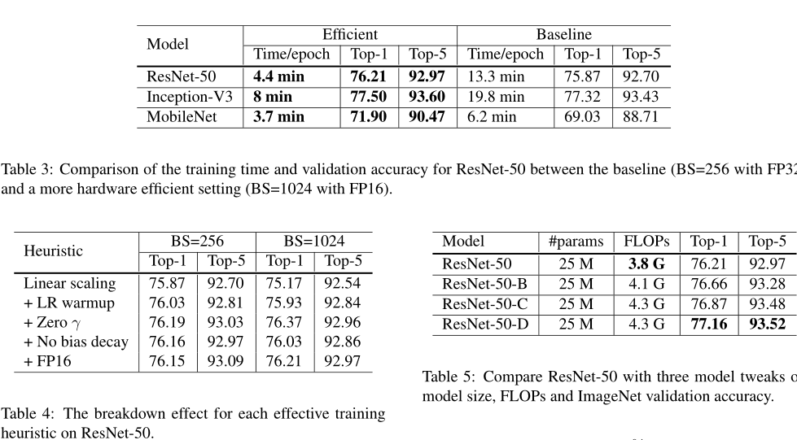
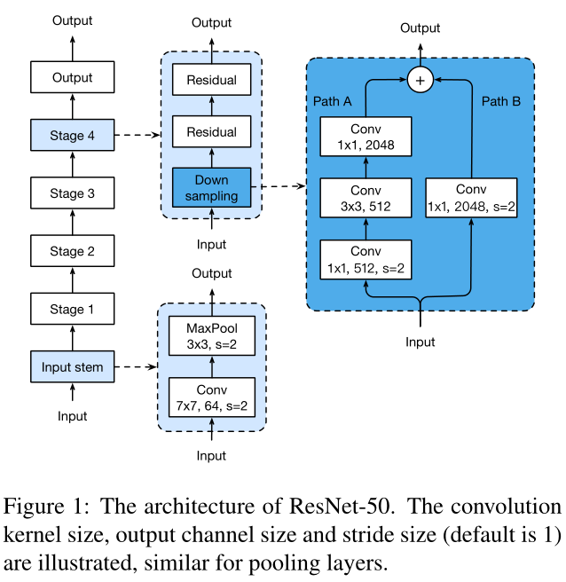
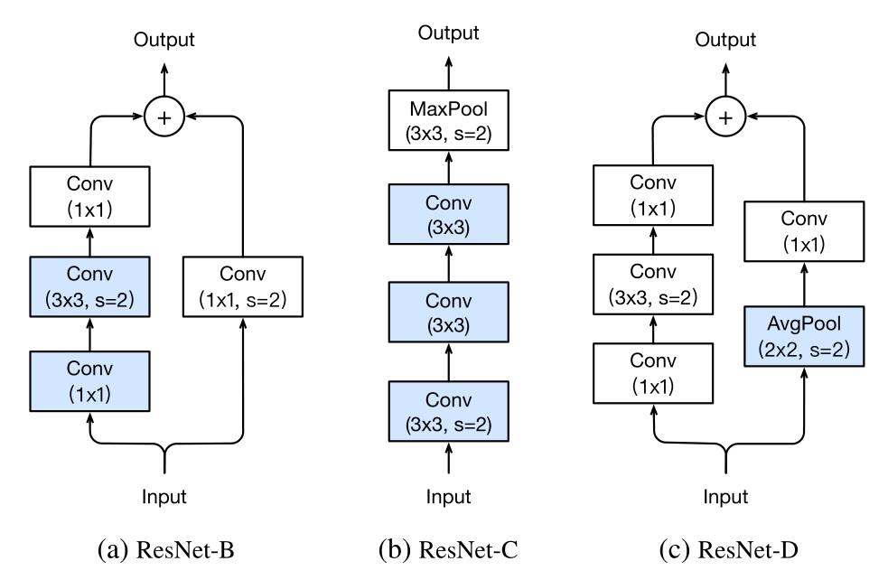

# 卷积神经网络图像分类技巧包

## 背景

图像分类取得的许多进展归功于训练程序的改进，如：数据增强、优化方法的变化。

然而在文献中，大多数改进要么在实现细节中被简要提及，要么仅在源代码中可见。

本文，检查了改进的集合，并通过消融实验研究它们对最终模型精度的影响。

***

## 内容

> 引入

自AlexNet问世，多种架构被提出，能够看到模型精确度稳步上升的趋势。然而准确率的提高不单单来自于准确率的提高。训练程序的改进，包括**损失函数的变化、数据预处理、优化方法**也发挥了重要的作用。

> 工作

测试了提高模型准确度、但几乎没有改变计算复杂度的训练程序和模型架构的集合。包括很多”tricks“，并在多个网络架构和数据集上进行评估，并报告它们对最终模型精度的影响。

概述：

1. 建立了baseline训练程序
2. 讨论了几个对于新硬件的有效训练非常有用的技巧
3. 回顾了ResNet的三个小模型架构调整，并提出了一个新的模型架构
4. 讨论四个额外的训练程序改进
5.  研究这些更精确的模型是否有助于迁移学习

---

### 训练程序baseline

> Baseline训练过程

使用ResNet作为baseline。训练和验证之间的预处理是不同的。

训练中：

1. 随机抽样一副图像，解码成32位浮点原始像素值[0, 255]
2. 随机裁剪长宽比为[3/4,  4/3] 随机采样的矩阵区域和面积为[8%, 100%]随机采样的区域，调整裁剪区域为224 * 224的图像
3. 水平翻转（概率为0.5）
4. 根据[0.6, 1.4]的系数统一划分色调，饱和度和亮度
5. 从正态分布N (0, 0.1)中采样添加PCA噪声的系数
6. 正则化RGB通道，通过分别减去123.68，116.779, 103.939 并除以 58.393, 57.12,
   57.375

验证时：

	1. 将每个图像的短边调整为256像素，同时保持长宽比
 	2. 裁剪出中心的224*224区域，并正则化（类似于训练的RGB通道）
 	3. 验证时不执行任何的随机增强

卷积层和全连接层的权值都用Xavier算法初始化

NAG加速梯度下降用于训练

每个模型在8个Nvidia V100 gpu上训练120 epoch，总批大小为256。学习率初始化为0.1，在第30、60和90个周期除以10

注解：pipeline：流水线（数据读取、数据预处理、创建模型、评估模型结果、模型调参）

> 有效训练

硬件，尤其是CPU近些年的快速发展，许多与性能相关的权衡已经改变。例如：现在在训练中使用较低的数值精度和较大的批处理规模更有效。接下来将回顾各种不牺牲模型准确度实现低精度和大批量的技术训练方法。有些方法甚至可以提高准确率和训练速度。

> > Large-batch training

小批量SGD将多个样本分组到一个小批，以增加并行性并降低通信成本。但是，大批量可能会减慢训练速度。对于凸问题收敛速度随着批量大小的增加而降低。换句话说，对于相同的周期数，与小批次训练的模型相比，大批次训练的模型验证精度下降。（本文研究四种启发式方法，它们有助于扩大单台机器训练的批大小）

> > Linear scaling learning rate

在小批SGD中，梯度下降是一个随机过程，因为每个批中的样例是随机的。增加批的大小不会改变随机梯度的期望，但会减少其方差。换句话说，大批量减少了梯度中的噪声，所以我们可以增加学习率，沿着梯度方向的相反方向取得更大的变化。

Goyal等人报告称，在ResNet-50训练中，学习率随批次大小的线性增加在经验上是有效的。具体而言，在批量大小为256的情况下选择0.1作为初始学习率，那么当改变更大的批量大小为b时，将初始学习率提高到0.1 * (b/256)

> > Learning rate warmup(学习率预热)

在训练开始时，所有参数都是典型的随机值，因此远离最终解。使用较大的学习率可能会导致训练不稳定，所以在热身启发式中，我们在开始时使用一个小的学习率，然后在训练过程稳定后切换回初始学习率。

Goyal等提出了一种循序渐进的热身策略，将学习率从0线性增加到初始学习率。具体来说，假设我们将使用前m批(例如5个数据周期)进行热身，初始学习率为η，那么在第i批，1≤i≤m时，我们将学习率设置为iη/m。

> > Zero γ

ResNet网络由多个剩余块组成，每个块由几个卷积层组成。给定的输入x,假设块(x)是块中最后一层的输出，这个剩余的块然后输出x +块(x)。块的最后一层可以是批处理规范化（BN）层。

> > No bias decay(无偏执衰退)

权重衰减可以用于所有可学习的参数，包括权重和偏执。

Jia等人指出，建议只将正则化应用于权重，以避免过拟合。无偏差衰减启发式遵循这一建议，它只将权值衰减应用于卷积层和全连接层中的权值。其他参数，包括BN层中的偏差和γ和β，都是非正则化的。

注意，LARS[4]提供了分层的自适应学习率，据报道，对于超大批处理大小(超过16K)非常有效。而在本文中，我们限制自己的方法足以单机训练，在这种情况下，批大小不超过2K往往导致良好的系统效率。

> Low-precision training

神经网络通常采用32位浮点(FP32)精度进行训练。也就是说，所有的数字都以FP32格式存储，算术运算的输入和输出也是FP32数字。然而，新的硬件可以增强算术逻辑单元，以满足较低精度的数据类型。例如，前面提到的Nvidia V100在FP32中提供14个TFLOPS，但在FP16中提供超过100个TFLOPS。英伟达的部分显卡针对FP16做了定制化优化，能够达到更快的计算速度，比如最新的显卡V100。

> 实验结果

> 模型调整

对网络架构得微小调整。例如：改变特定卷积层得步幅。这样的调整通常几乎不会改变计算复度。但可能对模型精度有不可忽略的影响。

本节以ResNet为例研究模型调整的效果。

> > ResNet 架构

> >修改后的架构

> > 

## 

## 结论

介绍了训练深度卷积神经网络以提高模型精度的十几个技巧。

这些技巧引入了对模型架构、数据预处理、损失函数和学习率的微小处理。在ResNet-50、Inception-V和MobileNet上的实验结果表明，这些技巧持续地提高了模型准确性。并且这些tricks的组合使用能显著提高准确性。并在迁移学习方面又很强的优势。